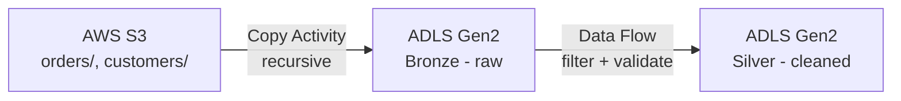

# AWS to Azure Data Migration Pipeline

An automated, incremental data pipeline that migrates data from AWS S3 into Azure using Azure Data Factory, following a Bronze → Silver medallion architecture.

## What this does

Data lands in an S3 bucket, gets picked up automatically on a schedule, copied into Azure Data Lake Storage Gen2, and cleaned into a structured layer — without any manual intervention.



## Why I built this

I wanted hands-on experience with cross-cloud data engineering rather than just reading about it — specifically, understanding how a real pipeline handles new data arriving over time instead of a one-off script that runs once and is done.

## Tech stack

- **AWS S3** — source storage
- **AWS IAM** — scoped, least-privilege access (read-only, single bucket)
- **Azure Data Factory** — orchestration, Linked Services, pipelines, triggers
- **Azure Data Lake Storage Gen2** — Bronze/Silver/Gold containers
- **ADF Data Flows** — no-code data cleaning (Spark under the hood)

## Key features

- **Fully automated** — a schedule trigger runs the pipeline every few minutes, no manual runs
- **Incremental loading** — a `windowStart`/`windowEnd` parameter pair, fed by `@trigger().scheduledTime`, filters the Copy activity to only pick up files modified since the last run
- **Medallion architecture** — Bronze holds an untouched, byte-for-byte copy of the source (using Binary format); Silver applies real cleaning rules (e.g. dropping rows with a null `order_id`) and writes structured Parquet output
- **Least-privilege security** — the IAM policy used by ADF only allows `ListBucket` and `GetObject` on one specific S3 bucket, nothing else in the AWS account

## How it works

1. A file lands in `s3://<bucket>/orders/` or `s3://<bucket>/customers/`
2. Every 5 minutes, a Schedule Trigger fires the pipeline
3. **Copy Activity** reads from S3 (recursively, preserving folder structure) and writes into the `bronze` container, filtered to only files modified in the trigger's time window
4. **Data Flow** reads the new Bronze file, filters out invalid rows, and writes cleaned Parquet output into the `silver` container
5. Bronze is retained forever as an immutable, raw audit trail; Silver is what downstream consumers (reports, dashboards) would query

## Folder structure

```
S3 bucket
├── orders/
│   └── orders_YYYY_MM_DD.csv
└── Customer/
    └── customers_YYYY_MM_DD.csv

ADLS Gen2
├── bronze/
│   ├── orders/...
│   └── Customer/...
└── silver/
    └── orders/...  (Parquet, cleaned)
```

## What's intentionally left out (for now)

- **Gold layer** — descoped for this pass; Bronze + Silver was enough to prove the full pattern end to end
- **Azure Key Vault** — credentials are stored directly in the Linked Service rather than a vault, a deliberate simplification for a learning project (Key Vault is the right call for anything production)
- **Event-driven triggering** — using a scheduled time-window filter (a simplified watermark pattern) instead of a full S3 → SNS → ADF event pipeline, to keep the AWS-side plumbing manageable

## Lessons learned

A good chunk of the real learning came from debugging, not building:
- A Data Flow silently pointed at the wrong dataset (Silver instead of Bronze) — a reminder to always double check source/sink bindings, not just assume a Data Flow "just works" once built
- Newer Azure Key Vaults use the RBAC permission model by default, so even the account that creates the vault needs an explicit role assignment before it can read/write secrets
- A stray file with an unrelated schema sitting in a source folder can silently break schema inference for an entire dataset

## Screenshots

**AWS S3 source bucket**


**Bronze / Silver / Gold containers in ADLS Gen2**


**Automated pipeline run — S3 to Bronze**


**Silver layer Data Flow — cleaning raw Bronze data**

